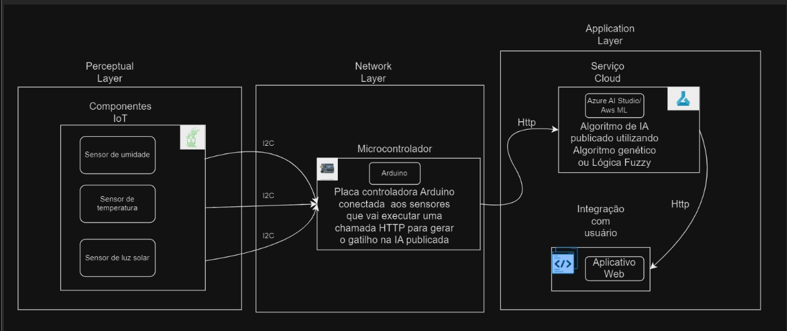

# Projeto Integrado de IoT e IA

**Alunos:** Eduardo Klug, João Artur Belli, Leonardo Rocha, Mateus de Faria da Silva, Mateus Mautone e Renan Iomes.

## Introdução ao Projeto
Este projeto integra tecnologias de Internet das Coisas (IoT) e Inteligência Artificial (IA) com o objetivo de resolver o problema de monitoramento e automação no cuidado de plantas. A solução proposta visa coletar, processar e analisar dados em tempo real sobre as condições de temperatura, umidade e iluminação ao redor das plantas, enviando notificações de alerta quando necessário. A importância desta solução reside na capacidade de melhorar a saúde das plantas, otimizar os recursos e reduzir o desperdício de água e energia.

## Funcionamento Geral
O projeto utiliza sensores IoT para capturar dados ambientais, como temperatura, umidade e intensidade de luz. Esses dados são enviados para uma central de processamento, onde algoritmos de IA, incluindo o uso de lógica Fuzzy, realizam a análise. A lógica Fuzzy é aplicada para lidar com incertezas e variabilidades nos dados, permitindo uma tomada de decisão mais flexível em tempo real. Os algoritmos de IA utilizam técnicas de aprendizado de máquina, lógica Fuzzy e, possivelmente, algoritmos genéticos para otimizar as decisões. A integração entre IoT e IA permite que o sistema funcione de maneira autônoma, realizando ações sem intervenção humana.

## Fluxo de Informações
O fluxo de dados no projeto começa com a captura de informações pelos sensores IoT posicionados em torno das plantas. Esses dados são transmitidos via rede para um servidor central, onde são processados:

- **Captura de Dados:** Sensores coletam informações de temperatura, umidade e intensidade de luz.
- **Transmissão:** Os dados são enviados para a central de processamento.
- **Processamento:** 
  - Limpeza e normalização dos dados.
  - Análise dos dados por algoritmos de IA.
- **Ação:** Os resultados são enviados aos atuadores IoT, que realizam ações como ativar a irrigação ou ajustar a iluminação.
- **Visualização:** Os dados e ações são apresentados ao usuário por meio de uma interface de visualização.

## Benefícios e Desafios
**Benefícios:**

- Automação no cuidado de plantas.
- Otimização de recursos como água e energia.
- Melhoria na saúde das plantas.
- Resposta rápida a mudanças nas condições ambientais.

**Desafios:**

- Garantir uma comunicação estável e segura entre os dispositivos IoT e a central de processamento.
- Desenvolver algoritmos de IA que sejam eficientes e robustos o suficiente para operar em tempo real.

  **Requisitos:**

  Requisitos Funcionais

1. Coleta de Dados dos Sensores:
   - O sistema deve ser capaz de coletar dados em tempo real de sensores de umidade do solo, temperatura ambiente e luz solar.

2. Processamento de Dados em Nuvem:
   - Os dados dos sensores devem ser enviados para um servidor na nuvem para processamento. O servidor deve ser capaz de armazenar e analisar os dados recebidos.

3. Algoritmos de IA:
   - O sistema deve utilizar algoritmos de Inteligência Artificial para analisar os dados dos sensores e prever as necessidades da planta, como irrigação ou ajuste de iluminação.

4. Notificações ao Usuário Final:
   - O sistema deve enviar notificações ao usuário final, via aplicativo móvel, com informações sobre as condições das plantas e recomendações de ações manuais (como ajustar a luz ou regar a planta).

5. Histórico de Dados:
   - O sistema deve manter um histórico das leituras dos sensores e das ações tomadas, permitindo a análise posterior pelo usuário.

6. Integração com Sistemas Externos (API):
   - O sistema deve ser capaz de integrar-se com outras plataformas, como serviços de IoT ou bases de dados de terceiros, utilizando APIs padronizadas.


 Requisitos Não Funcionais

1. Desempenho:
   - O sistema deve processar dados e executar comandos de forma eficiente, garantindo que a resposta às mudanças nas condições das plantas seja rápida (latência máxima de 5 segundos).

2. Escalabilidade:
   - O sistema deve ser escalável para suportar várias plantas e sensores, podendo processar grandes volumes de dados conforme o número de usuários e dispositivos conectados aumenta.

3. Segurança:
   - Os dados transmitidos entre os sensores, o microcontrolador e o servidor na nuvem devem ser protegidos por criptografia para garantir a privacidade e segurança das informações.

4. Confiabilidade:
   - O sistema deve ser robusto e confiável, com uma taxa mínima de falha. O tempo de atividade esperado para o servidor na nuvem deve ser de pelo menos 99,9%.

5. Portabilidade:
   - O sistema deve ser compatível com diferentes tipos de sensores e microcontroladores, facilitando a adaptação a novas tecnologias de hardware.

6. Manutenibilidade:
   - O código do sistema deve ser modular e bem documentado, facilitando a manutenção e a atualização dos componentes (tanto de hardware quanto de software).
   - 
7. Disponibilidade:
   - O sistema deve estar disponível 24 horas por dia, 7 dias por semana, garantindo que os sensores possam coletar e enviar dados continuamente e que o usuário tenha acesso constante às informações.

## Orçamento
| Item                                   | Custo (R$) |
|----------------------------------------|------------|
| Sensor de Temperatura e Umidade DHT11  | 11,90      |
| Esp8266 - Módulo Wifi Esp8266 Nodemcu V3 Ch340 | 25,75      |
| Cabo MicroUSB                          | 65,00      |
| Protoboard                             | 20,00      |
| Sensor de Luz                          | 00,00      |
| Cabo Jumper                            | 00,00      |
| Resistor                               | 00,00      |

## Diagrama do Projeto


## URL da IA Publicada
A IA do projeto está publicada em uma Lambda da AWS com API Gateway. Segue a URL e exemplo de requisição:

**URL POST:**  
https://6fwmz9m4gf.execute-api.us-east-1.amazonaws.com/default/automatic-gardener-api

**Body:**  
```json
{
    "temp": "value1",
    "humid": "value2",
    "light": "value3"
}
```

Com este sistema, é possível enviar os dados de temperatura, umidade e iluminação para análise automática, permitindo o controle remoto e a automação do processo de cuidado das plantas.
